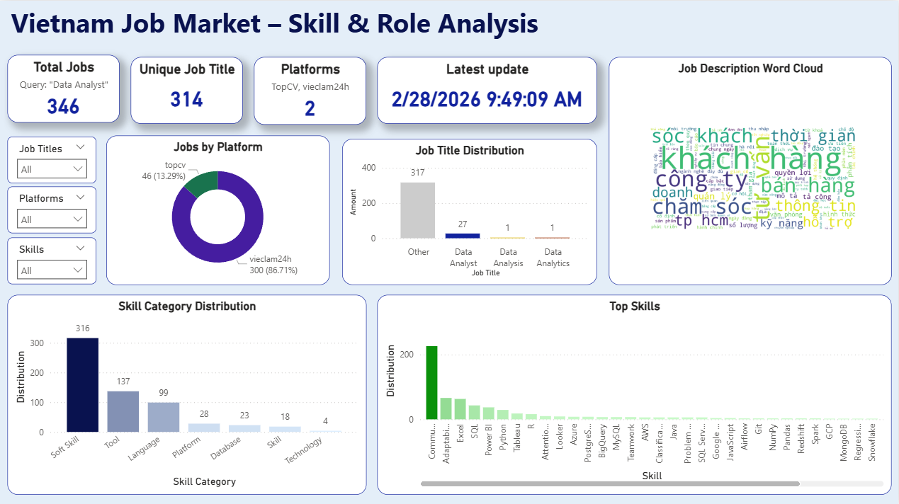

# End-to-End Job Market Analytics Pipeline

A lightweight ETL pipeline for analyzing the Vietnamese job market, with a focus on Data Analyst positions. The pipeline scrapes job listings from multiple platforms, extracts structured insights, and stores analytics-ready data in SQLite.

## Features

- **Multi-Platform Web Scraping**: Concurrent scraping from CareerViet, TopCV, and ViecLam24h
- **Data Extraction**: Automated extraction of job titles, skills, salary ranges, and seniority levels
- **Data Quality**: NULL values for missing fields instead of empty strings
- **SQL Analytics**: Pre-built views for analysis and reporting
- **Test Coverage**: Unit tests for scrapers, transformers, and loaders
- **Minimal Dependencies**: Lightweight and fast with no heavy ML models

## Architecture

```
job_market_analytics/
├── src/
│   ├── orchestrator.py       # Manages concurrent scraping across platforms
│   ├── pipeline.py           # Main ETL workflow orchestration
│   ├── config.py             # Skill/seniority configurations
│   ├── scrapers/             # Platform-specific scrapers (3 platforms)
│   ├── transform/            # Data transformation and extraction
│   ├── load/                 # Database loading logic
│   └── utils/                # Shared utilities (database, logging)
├── sql/                      # Database schema and analytics views
├── powerbi/                  # Power BI dashboard templates
├── tests/                    # Unit and integration tests
├── data/                     # SQLite database location
├── logs/                     # Runtime logs
└── requirements.txt          # Python dependencies
```

---

## Setup and Installation

### Prerequisites
- Python 3.9+
- pip (Python package installer)
- Virtual environment (recommended)

### Installation Steps

1. **Clone the repository:**
   ```bash
   git clone https://github.com/nguyentunhu/job_market_analytics.git
   cd job_market_analytics
   ```

2. **Create a virtual environment:**
   ```bash
   python -m venv venv
   .\venv\Scripts\activate      # On Windows
   # source venv/bin/activate   # On macOS/Linux
   ```

3. **Install dependencies:**
   ```bash
   pip install -r requirements.txt
   ```
   This installs:
   - `beautifulsoup4` + `requests` (web scraping)
   - `SQLAlchemy` (database ORM)
   - `pandas` (data manipulation)
   - `pytest` (testing)

---

## Running the Pipeline

### Full ETL Pipeline
```bash
python -m src.pipeline 
```

This performs:
1. Database schema initialization
2. Concurrent scraping from 3 platforms (10 pages, max 500 jobs each)
3. Data transformation: skill extraction and seniority detection
4. Salary extraction and validation
5. Data loading into SQLite

**Expected Output:**
- `data/job_market_analytics.db` (SQLite database)
- `logs/pipeline.log` (execution log)
- Console output with statistics (jobs scraped, transformed, loaded)

### Scraping Configuration

Edit `src/orchestrator.py` to customize:
```python
orchestrator = Orchestrator(
    max_workers=3,                  # Concurrent threads
    max_results_per_platform=500,   # Max jobs per platform
    request_delay=2.0               # Delay between requests (seconds)
)

raw_jobs = orchestrator.scrape(
    query="Data Analyst",           # Search query
    max_pages=10,                   # Pages per platform
    enabled_platforms=['topcv', 'careerviet', 'vieclam24h']  # Which to scrape
)
```

### Running Tests
```bash
pytest tests/ -v             # Verbose output
pytest tests/ --cov=src      # With coverage report
pytest tests/test_transform/test_skill_extraction.py  # Specific test
```

---

## Data Schema

### Extracted Fields (with NULL handling)
- **Core**: platform, job_url, job_title, platform_job_id
- **Compensation**: salary_min, salary_max, salary_currency (NULL if not specified)
- **Level**: seniority_level (NULL if not detected)
- **Skills**: extracted_skills list with categories
- **Timestamps**: scraped_at (ISO format)
- **Descriptions**: raw_description, clean_description

### Database Tables
- **jobs**: Main fact table with job listings
- **skills**: Skill dimension table
- **job_skills**: Many-to-many bridge table linking jobs and skills
- **job_descriptions**: Raw and cleaned job descriptions

### Database Views
- `job_market_analytics_views.sql` includes pre-built SQL views for:
  - Skills demand analysis
  - Salary statistics by seniority level
  - Job count by platform

---

## Key Design Decisions

1. **NULL over Empty Strings**: Missing data is stored as NULL for proper SQL analytics
2. **Concurrent Scraping**: ThreadPoolExecutor runs all platforms in parallel (faster collection)
3. **Simplified Stack**: No heavy dependencies; focus on core ETL functionality
4. **Skill Configuration-Based**: Seniority and skill detection uses regex patterns from config files
5. **SQLite for Portability**: No external database required; single .db file is portable
6. **Modular Structure**: Each component (scraper, transformer, loader) is independently testable

---

## Dependencies & Performance

### Core Dependencies
- **requests**: HTTP requests for web scraping
- **beautifulsoup4**: HTML parsing
- **SQLAlchemy**: Database ORM
- **pandas**: Data manipulation
- **pytest**: Testing framework

### Performance Metrics
- Scraping: ~5-10 seconds per page per platform (with 2-second delays)
- Transformation (100 jobs): ~100-200ms (no ML model overhead)
- Full pipeline (1,500 jobs): ~1-2 minutes end-to-end
- Memory: ~50-100 MB (lightweight processing)


---

## End-to-End Data Flow

The pipeline follows a clear Extract-Transform-Load (ETL) pattern:

1. **Extract (Scrapers)**: Individual scraper modules (e.g., `careerviet_scraper.py`, `topcv_scraper.py`) extend `BaseScraper`, handling HTTP requests, pagination, and rate-limiting for each platform.

2. **Orchestrator (`orchestrator.py`)**: Manages concurrent execution of multiple scrapers using ThreadPoolExecutor. Aggregates all raw job data from different platforms into a single unified list.

3. **Transform (`job_transformer.py`)**: 
   - Cleans and normalizes job descriptions
   - Detects seniority levels using regex patterns
   - Extracts salary ranges (VND format)
   - Identifies skills and technologies mentioned

4. **Load (`load_to_db.py`)**: Inserts transformed data into SQLite tables (jobs, skills, job_skills), handling deduplication and maintaining referential integrity.

5. **SQL Analysis (`02_analytics_views.sql`)**: Pre-built views simplify common analytical queries.

6. **Dashboard Integration**: Structured database enables any BI tool (Power BI, Tableau, Streamlit) to visualize insights.

---

## Power BI Dashboard

A Power BI dashboard template is available in the `powerbi/` folder for visualizing job market insights.



**Dashboard Overview**: This dashboard provides a comprehensive view of the Vietnamese job market data with interactive visualizations, enabling data-driven insights into skills demand, salary trends, and platform performance.

---

## Config Files

### Skills Configuration (`src/config.py`)
Add new skills and keywords to track emerging demands:
```python
'programming_languages': {
    'Python': ['python', 'py'],
    'SQL': ['sql', 'tsql', 'plsql'],
    # Add more skills here
}
```

### Seniority Levels (`src/config.py`)
Configure detection patterns:
```python
'director_vp': ['director', 'vp', 'c-level'],
'manager_lead': ['manager', 'lead', 'architect'],
'senior': ['senior', 'sr.', 'principal'],
```
